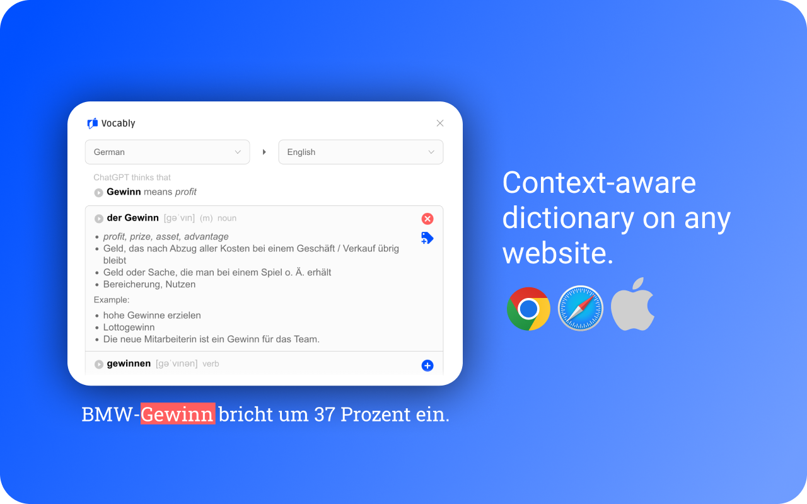
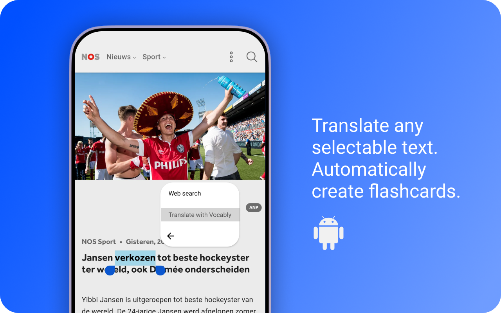
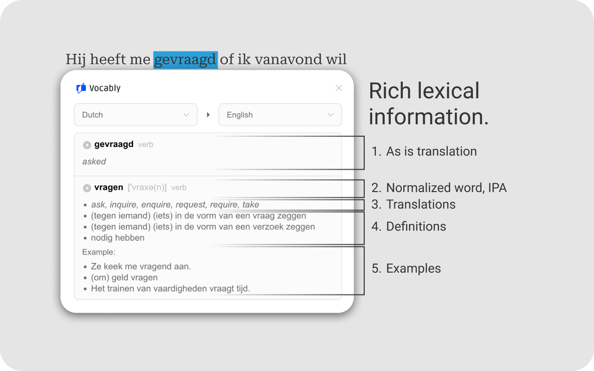
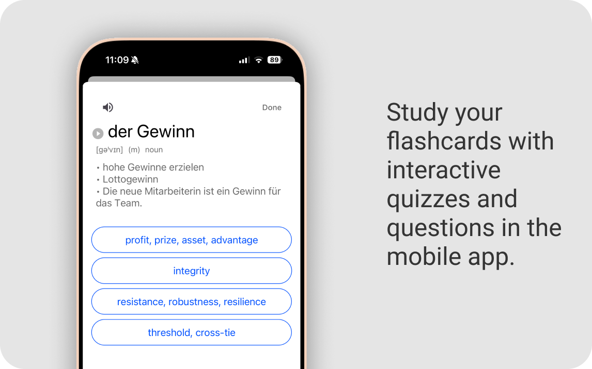
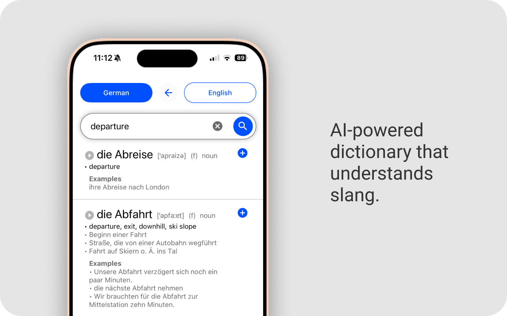
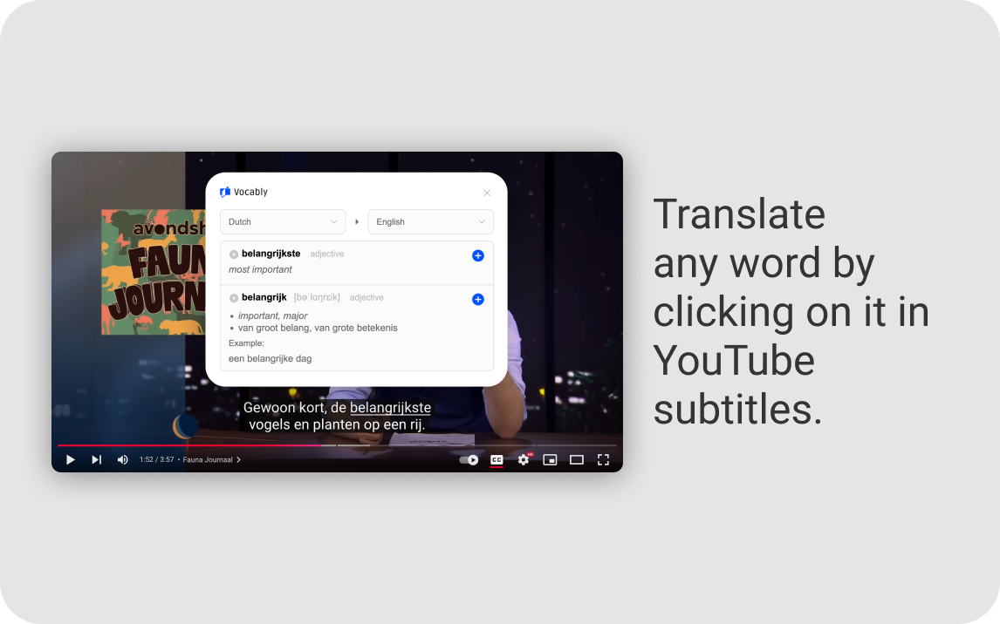

# Vocably — a language-learning tool for active language users.

## How it works

1. Select any new word (or phrase) (supports Chrome, Safari, iOS Safari, Android, and YouTube on Desktop).
1. Translate it + Save it to your collection.
1. Learn the words from your collection on your mobile device.

## Works everywhere

Vocably exists in multiple forms:

- Browser extensions for [Desktop Chrome](https://chromewebstore.google.com/detail/vocably/baocigmmhhdemijfjnjdidbkfgpgogmb), [Desktop Safari](https://apps.apple.com/app/vocably-for-safari/id6464076425), and [iOS Safari](https://apps.apple.com/app/vocably-pro-language-cards/id1641258757)
- Mobile application for [iOS](https://apps.apple.com/app/vocably-pro-language-cards/id1641258757) and [Android](https://play.google.com/store/apps/details?id=com.vocablypro)

## In a nutshell

